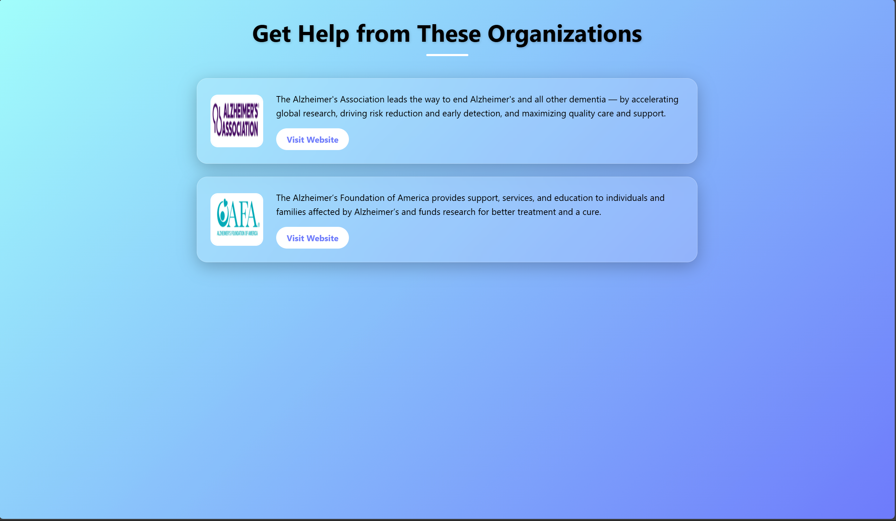

### 🔗 Live Demo
Demo video of the website: https://www.youtube.com/watch?v=LM9doDIdOm0

<h2>Overview</h2>

MemoCare is an intuitive platform designed to aid in the detection and classification of Alzheimer's disease using deep learning models. The site enables users to upload MRI scan images for analysis and provides reliable classification into categories such as:

<ul>
    <li>Non-Demented</li>
    <li>Very Mild Demented</li>
    <li>Mild Demented</li>
    <li>Moderate Demented</li>
</ul>

Additionally, the platform allows users to input medical data for classification, helping to determine whether a patient is likely to have Alzheimer's or not. This dual approach provides a comprehensive tool for early detection and monitoring of Alzheimer's disease progression.

This project serves as a tool to assist healthcare professionals and researchers in the early detection and monitoring of Alzheimer's disease progression. Additionally, the platform incorporates two distinct models:

<ul>
    <li><strong>MRI Scan Model:</strong> This model analyzes MRI scan images and classifies them into the four stages of dementia: Non-Demented, Very Mild Demented, Mild Demented, and Moderate Demented.The models used were DenseNet201 for feature extraction(excluding the top layer) and ANN for classification</li>
    <li><strong>Medical Data Model:</strong> This model takes in user medical data and provides a classification indicating whether the user is likely to have Alzheimer's or not.The method used was ensemble learning technique in which the base learners were RandomForestClassifier and GradientBoostingClassifier and Meta Learner was Logistic Regression  </li>
</ul>

Furthermore, users can generate a detailed PDF report based on the medical data they provide, summarizing the analysis and classification results.

<h2>Features</h2>
<ul>
    <li><strong>Image Upload:</strong> Users can easily upload MRI scan images for analysis.</li>
    <li><strong>Medical Data Input:</strong> Users can enter medical data (e.g., age, medical history, etc.) for analysis.</li>
    <li><strong>Classification Results:</strong> The site provides accurate classification results from both the MRI scan and medical data models.</li>
    <li><strong>PDF Generation:</strong> Based on the medical data provided, users can generate a detailed PDF report summarizing the classification results and analysis.</li>
    <li><strong>Get Help Page:</strong> Helps patients belonging to a weaker economical class or requiring some sort of aid to directly connect with local or international charity organizations.
    <li><strong>User-Friendly Interface:</strong> Built with Flask and Jinja2, the website is simple and intuitive to navigate.</li>
    <li><strong>Robust Models:</strong> Powered by deep learning models trained on an extensive dataset of MRI scans and medical data.</li>
</ul>

<h2>Dataset</h2>

This project utilizes two distinct models, each with its own dataset:

<h3>Model-1: Medical Data Model</h3>

Model-1 uses a comprehensive medical dataset that contains health information for 2,149 patients, uniquely identified with IDs ranging from 4751 to 6900. The dataset includes demographic details, lifestyle factors, medical history, clinical measurements, cognitive and functional assessments, symptoms, and a diagnosis of Alzheimer's Disease. This dataset is ideal for researchers and data scientists looking to explore factors associated with Alzheimer's, develop predictive models, and conduct statistical analyses.

The dataset includes the following sections:

<ul>
    <li><strong>Patient Information:</strong> Patient ID (ranging from 4751 to 6900)</li>
    <li><strong>Demographic Details:</strong> Age, Gender, Ethnicity, Education Level</li>
    <li><strong>Lifestyle Factors:</strong> BMI, Smoking, Alcohol Consumption, Physical Activity, Diet Quality, Sleep Quality</li>
    <li><strong>Medical History:</strong> Family History of Alzheimer's, Cardiovascular Disease, Diabetes, Depression, Head Injury, Hypertension</li>
    <li><strong>Clinical Measurements:</strong> Systolic and Diastolic Blood Pressure, Cholesterol Levels (Total, LDL, HDL, Triglycerides)</li>
    <li><strong>Cognitive and Functional Assessments:</strong> MMSE, Functional Assessment, Memory Complaints, Behavioral Problems, ADL</li>
    <li><strong>Symptoms:</strong> Confusion, Disorientation, Personality Changes, Difficulty Completing Tasks, Forgetfulness</li>
    <li><strong>Diagnosis Information:</strong> Diagnosis of Alzheimer's Disease (0 for No, 1 for Yes)</li>
</ul>

The dataset can be found at the following link: 
<a href="https://www.kaggle.com/datasets/rabieelkharoua/alzheimers-disease-dataset/data">Medical Data Dataset on Kaggle</a>

<h3>Model-2: MRI Scan Image Model</h3>

Model-2 uses a dataset of MRI scan images for classifying the severity of Alzheimer's Disease. The dataset consists of a total of 6400 images divided into four categories:

<ul>
    <li><strong>Mild Demented:</strong> 896 images</li>
    <li><strong>Moderate Demented:</strong> 64 images</li>
    <li><strong>Very Mild Demented:</strong> 2240 images</li>
    <li><strong>Non-Demented:</strong> 3200 images</li>
</ul>

To address the imbalance and reduce overfitting, data augmentation techniques were applied to expand the dataset. After augmentation, the total number of images increased to 12,072, with the following distribution:

<ul>
    <li><strong>Mild Demented:</strong> 2961 images</li>
    <li><strong>Moderate Demented:</strong> 2748 images</li>
    <li><strong>Very Mild Demented:</strong> 3163 images</li>
    <li><strong>Non-Demented:</strong> 3200 images</li>
</ul>

The dataset can be found at the following link: 
<a href="https://www.kaggle.com/datasets/raihannaufalramadhan/alzheimer-data">MRI Scan Dataset on Kaggle</a>

<h2>Accuracy , Precision and Recall</h2>

<h4>Alzheimer Prediction Model</h4>

**Accuracy** : `95.81%`

**Label Legend**:  
- `0` → Negative for Alzheimer’s  
- `1` → Positive for Alzheimer’s

### 📊 Classification Report

| Class | Precision | Recall | F1-Score | Support |
|-------|-----------|--------|----------|---------|
| 0 (No Alzheimer’s) | 0.96 | 0.98 | 0.97 | 277 |
| 1 (Positive Alzheimer’s) | 0.96 | 0.92 | 0.94 | 153 |

**Overall Accuracy**: `0.96`  
**Macro Average**: `Precision: 0.96`, `Recall: 0.95`, `F1-Score: 0.95`  
**Weighted Average**: `Precision: 0.96`, `Recall: 0.96`, `F1-Score: 0.96`

<h4>Dementia Detection Model </h4>

**Test Accuracy**:93.24%

| Class Label | Description        | Precision | Recall | F1-Score | Support |
| ----------- | ------------------ | --------- | ------ | -------- | ------- |
| 0           | Non-Demented       | 0.97      | 0.93   | 0.95     | 717     |
| 1           | Very Mild Demented | 0.84      | 1.00   | 0.91     | 52      |
| 2           | Mild Demented      | 0.99      | 0.90   | 0.94     | 2560    |
| 3           | Moderate Demented  | 0.86      | 0.98   | 0.91     | 1792    |

### Averages

**Macro Avg:**
Precision: 0.91, Recall: 0.95, F1-Score: 0.93

**Weighted Avg:**
Precision: 0.94, Recall: 0.93, F1-Score: 0.93
        
<h2>Technologies Used</h2>
<ul>
    <li><strong>Backend:</strong> Flask framework with Jinja2 template engine.</li>
    <li><strong>Frontend:</strong> HTML, CSS, and JavaScript.</li>
    <li><strong>Machine Learning:</strong> TensorFlow and Scikit-learn for model development.</li>
    <li><strong>Data Handling:</strong> Pandas and NumPy for data preprocessing.</li>
    <li><strong>PDF Generation:</strong> Python libraries such as FPDF for generating PDF reports based on medical data.</li>
</ul>

<h2>Usage</h2>
<ol>
    <li>Navigate to the website.</li>
    <li>Upload a MRI scan image in the supported format or input medical data.</li>
    <li>Click the "Analyze" button to classify the image or medical data.</li>
    <li>View the classification results on the results page. For MRI scans, the result will indicate the dementia stage, and for medical data, it will indicate Alzheimer's or Non-Alzheimer's status.</li>
    <li>If you provided medical data, you can generate a PDF report summarizing the analysis by clicking the "Generate PDF" button.</li>
</ol>

<h2>File Structure</h2>
<ul>
    <li><strong>app.py:</strong> Main Flask application file.</li>
    <li><strong>templates/:</strong> Contains HTML files for the website.</li>
    <li><strong>static/:</strong> Includes CSS, JavaScript, and image assets.</li>
    <li><strong>models/:</strong> Pre-trained deep learning models for MRI scan and medical data classification.</li>
    <li><strong>data/:</strong> Organized dataset for training and testing, including MRI scan images and medical records.</li>
</ul>
<h2>🆘 Get Help Page</h2>

The **Get Help** page provides users and caregivers with a curated list of support organizations that assist Alzheimer's patients. 

- You can access this feature by clicking the **heart icon** at the top-right corner of the dashboard.
- The page opens a well-structured list of verified support groups, clinical resources, and helpline services dedicated to Alzheimer's care.
- This ensures users are not only informed about diagnosis but also guided toward the **next steps in real-world care**, whether through local services, research trials, or caregiver aid.

<h2>Contact</h2>

For inquiries, please contact:

<ul>
    <li><a href="mailto:first_email@example.com">btech10357.23@bitmesra.ac.in</a></li>
    <li><a href="mailto:second_email@example.com">btech10336.23@bitmesra.ac.in</a></li>
</ul>

<strong>Copyright Notice</strong>

All rights are reserved by the author. Unauthorized use or distribution of this code is prohibited.

